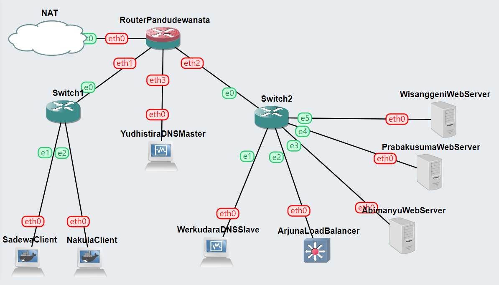

# Jarkom-Modul-2-B24-2023
## DNS dan Web Server
Anggota kelompok:
| Nama Anggota | NRP |
| ------------- | ------------- |
| Gilang Aliefidanto  | 5025211119  |
| Vito Febrian Ananta  | 5025211224  |

### 1. Yudhistira akan digunakan sebagai DNS Master, Werkudara sebagai DNS Slave, Arjuna merupakan Load Balancer yang terdiri dari beberapa Web Server yaitu Prabakusuma, Abimanyu, dan Wisanggeni.
Pada soal pertama kami diminta untuk membuat topologi yang telah ditentukan oleh asisten. Kami juga melakukan pengaturan terhadap IP supaya akan membedakan dengan kelompok lain. Setelah mengatur baik di Virtual Machine dan di GNS3, kami membuat project pada GNS 3 dan membuat topologi sesuai dengan perintah dari asisten.

Keterangan:
Tipe topologi: 2

Setelah itu, setting semua node ubuntu:

### 2. Buatlah website utama pada node arjuna dengan akses ke arjuna.yyy.com dengan alias www.arjuna.yyy.com dengan yyy merupakan kode kelompok.

### 3. Dengan cara yang sama seperti soal nomor 2, buatlah website utama dengan akses ke abimanyu.yyy.com dan alias www.abimanyu.yyy.com.

### 4. Kemudian, karena terdapat beberapa web yang harus di-deploy, buatlah subdomain parikesit.abimanyu.yyy.com yang diatur DNS-nya di Yudhistira dan mengarah ke Abimanyu.

### 5. Buat juga reverse domain untuk domain utama. (Abimanyu saja yang direverse)

### 6. Agar dapat tetap dihubungi ketika DNS Server Yudhistira bermasalah, buat juga Werkudara sebagai DNS Slave untuk domain utama.

### 7. Seperti yang kita tahu karena banyak sekali informasi yang harus diterima, buatlah subdomain khusus untuk perang yaitu baratayuda.abimanyu.yyy.com dengan alias www.baratayuda.abimanyu.yyy.com yang didelegasikan dari Yudhistira ke Werkudara dengan IP menuju ke Abimanyu dalam folder Baratayuda.

### 8. Untuk informasi yang lebih spesifik mengenai Ranjapan Baratayuda, buatlah subdomain melalui Werkudara dengan akses rjp.baratayuda.abimanyu.yyy.com dengan alias www.rjp.baratayuda.abimanyu.yyy.com yang mengarah ke Abimanyu.

### 9. Arjuna merupakan suatu Load Balancer Nginx dengan tiga worker (yang juga menggunakan nginx sebagai webserver) yaitu Prabakusuma, Abimanyu, dan Wisanggeni. Lakukan deployment pada masing-masing worker.

### 10. Kemudian gunakan algoritma Round Robin untuk Load Balancer pada Arjuna. Gunakan server_name pada soal nomor 1. Untuk melakukan pengecekan akses alamat web tersebut kemudian pastikan worker yang digunakan untuk menangani permintaan akan berganti ganti secara acak. Untuk webserver di masing-masing worker wajib berjalan di port 8001-8003. Contoh
    - Prabakusuma:8001
    - Abimanyu:8002
    - Wisanggeni:8003

###

###
